# 🏗️ Master Architecture Diagram

This document visualizes the data flow and component relationships within the Annual Report Summarizer. Understanding this "map" is essential for explaining the project structure during your viva.

## 🔄 System Workflow Diagram

```mermaid
graph TD
    A["📄 User Uploads PDF<br/>(app.py)"] --> B["🔍 PDF Processor<br/>(pdf_processor.py)"]
    
    subgraph "Core Analysis Engine"
        B --> C["📑 Section Identification<br/>(Keyword Matching)"]
        B --> D["🎨 Layout Analysis<br/>(layout_analyzer.py)"]
        B --> E["📊 Table Extraction<br/>(pdfplumber)"]
    end
    
    C --> F["🌍 Multilingual Hub<br/>(multilingual_summarizer.py)"]
    
    subgraph "Summarization Logic"
        F --> G["🔡 Language Detection<br/>(language_detector.py)"]
        F --> H["🔁 Translate-Summarize-Translate<br/>(translator.py)"]
        F --> I["📝 Direct Summarization<br/>(IndicBART)"]
    end
    
    H --> J["🧠 AI Brain<br/>(abstractive_summarizer.py)"]
    H --> K["✂️ Statistical Picker<br/>(extractive_summarizer.py)"]
    
    J --> L["✨ local Punjabi Model<br/>(Custom Fine-tuned)"]
    
    L --> M["✅ Final Dashboard Results<br/>(Streamlit Tabs)"]
    I --> M
    K --> M
    E --> M
    D --> M
```

---

## 🛠️ Component Breakdown

### 1. Frontend Layer (`app.py`)
- **Responsibility:** User Interaction & Session State.
- **Data Flow:** Captures PDF input -> triggers Backend -> Receives results -> Displays via Plotly/Dataframes.

### 2. Processing Layer (`pdf_processor.py`, `layout_analyzer.py`)
- **Responsibility:** Structural Parsing.
- **Function:** Converts a "flat" PDF into a structured object containing text blocks, coordinates, and sections.

### 3. Intelligence Layer (`summarizer.py`, `abstractive_summarizer.py`, `extractive_summarizer.py`)
- **Responsibility:** Meaning Extraction.
- **Function:** Uses BART/Transformer models to condense the meaning of large text chunks into concise summaries.

### 4. Linguist Layer (`multilingual_summarizer.py`, `translator.py`, `language_detector.py`)
- **Responsibility:** Cross-Lingual Support.
- **Function:** Detects the language script (e.g., Devanagari, Gurmukhi) and routes it to the appropriate translation/summarization engine.

---

## 🚦 Data Flow Example: Summarizing a Punjabi Report
1. **Detection:** `language_detector.py` identifies Gurmukhi script -> sets language to `pa`.
2. **Translation:** `translator.py` uses the **Local Punjabi Model** to convert text to English.
3. **Summarization:** `abstractive_summarizer.py` creates an English summary of that text.
4. **Final Step:** `translator.py` converts the English summary back to Punjabi for display.
勾
